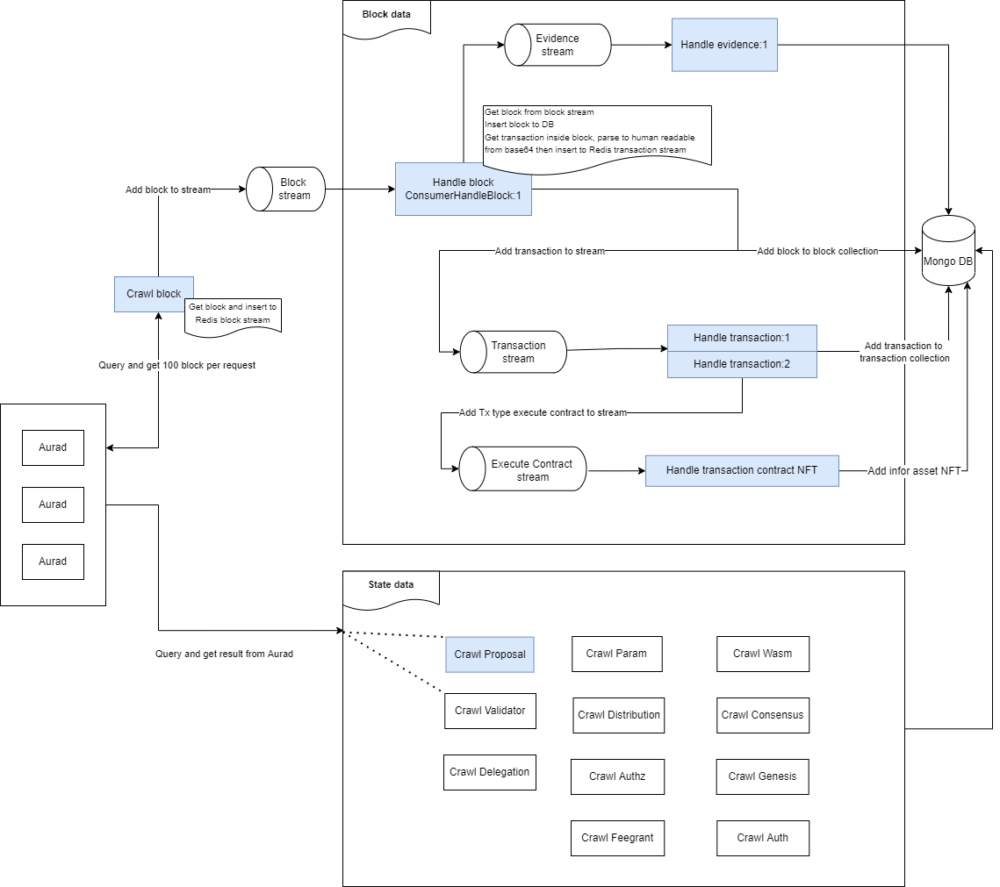
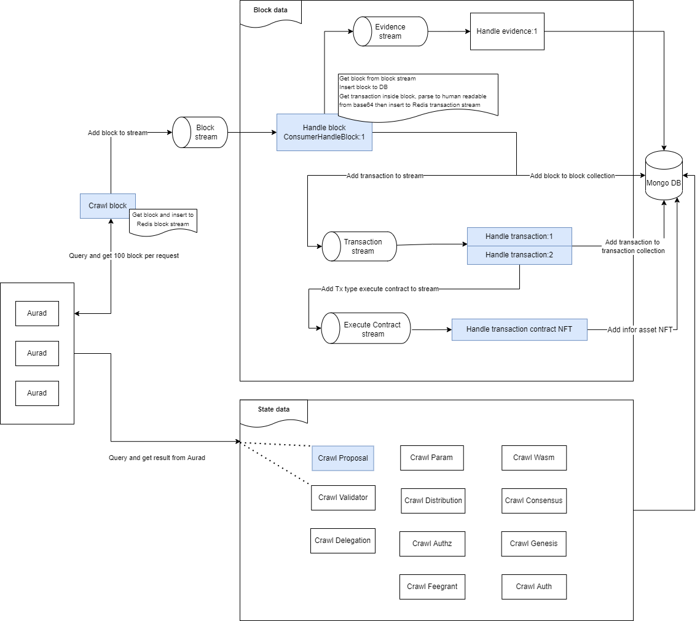

# Aura Indexer

Aura Indexer is an indexing service for Cosmos-based blockchain. It crawl data from the blockchain and index it into mongoDB. Based on the data, it can provide search functionality instead of querying data from LCD or RPC directly.

Currently, it supports network builded by Cosmos SDK v0.45.1 or later. Testing network:

-   [Aura Network](https://github.com/aura-nw/aura)
-   [Osmosis](https://github.com/osmosis-labs/osmosis)
-   [Cosmos Hub](https://github.com/cosmos/gaia)

Aura Indexer includes 2 main components:

-   Crawler: crawl data from the blockchain and index it into mongoDB
-   Backend API: provide search functionality through RESTful API

## Main flow crawl

The crawl system devides the data into 2 parts:

-   **Block data**: the data in the block (block information, transaction, evidence)
-   **State data**: the data change in each state of the block (distribution, reward, delegation, community pool)



Most of services are small Node application written in Typescript. The Node services are built using [Moleculerjs](https://moleculer.services/) framework.
With Crawler, we use [Bull](https://github.com/OptimalBits/bull/tree/master) to manage the queue of crawling. High scalability is required for crawling, we use [Redis Stream](https://redis.io/docs/manual/data-types/streams/) to implement **Consumer Group** pattern.

## Architect backend api



## List services (currently)

-   **api-gateway**: API Gateway services for backend API, query data from DB

    -   _network_: get community pool, pool and inflation
    -   _block_: get block information
    -   _transaction_: get transaction information
    -   _proposal_: get proposal information
    -   _validator_: get validator information
    -   _account-info_: get information of a wallet onchain
    -   _asset_: manage, register asset
-   [**crawl-block**](./docs/sequence-diagram/CrawlBlock.png): get block from network and store it in redis stream
-   [**handle-block**](./docs/sequence-diagram/HandleBlock.png): get block from redis stream, then get transaction, evidence in block and put them to redis stream equivalent
-   [**crawl-transaction**](./docs/sequence-diagram/CrawlTransaction.png): get transaction by hash from network and store it in redis stream
-   [**handle-transaction**](./docs/sequence-diagram/HandleTransaction.png): get transaction from redis stream then handle
-   [**crawl-param**](): param from module Bank, Distribution, Governance, IBC Transfer, Mint, Staking, Slashing
-   [**crawl-proposal**](./docs/sequence-diagram/CrawlProposal.png), [**crawl-tally-proposal**](./docs/sequence-diagram/CrawlProposal-Tally.png): proposal and tally result (if proposal in voting period)
-   [**crawl-distribution**](): get data community pool
-   [**crawl-staking-validator**](./docs/sequence-diagram/CrawlStaking-Validator.png), [**crawl-staking-pool**](./docs/sequence-diagram/CrawlStaking-Validator.png): get data pool, information about validator
-   [**crawl-mint**](): get inflation
-   [**handle-address**](./docs/sequence-diagram/HandleAddress.png): get information of a wallet onchain
    -   [_crawl-account-auth_](./docs/sequence-diagram/CrawlAccountAuth.png): get auth information
    -   [_crawl-account-balances_](./docs/sequence-diagram/CrawlAccountBalances.png): get balance of all coins
    -   [_crawl-account-delegations_](./docs/sequence-diagram/CrawlAccountDelegations.png): get delegation information
    -   [_crawl-account-redelegations_](./docs/sequence-diagram/CrawlAccountRedelegations.png): get redelegation information 
    -   [_crawl-account-unbonds_](./docs/sequence-diagram/CrawlAccountUnbonds.png): get unbond information
    -   [_crawl-account-spendable-balances_](./docs/sequence-diagram/CrawlAccountSpendableBalances.png): get spendable balance of all coins

## Install requirements

-   **Redis**: `docker run --name redis -p 6379:6379 -d redis`
-   **MongoDB**: `docker run --name mongo -p 27017:27017 -d redis`

## How to run

```bash
# create file env
cp .env.example .env
# then replace env field with your own value, point SERVICE to service you want to run

# run with moleculer cli
npm run dev
```

## NPM scripts

-   `npm run dev`: Start development mode (load all services locally with hot-reload & REPL)
-   `npm run start`: Start production mode (set `SERVICES` env variable to load certain services)
-   `npm run cli`: Start a CLI and connect to production. Don't forget to set production namespace with `--ns` argument in script
-   `npm run lint`: Run ESLint
-   `npm run ci`: Run continuous test mode with watching
-   `npm test`: Run tests & generate coverage report
-   `npm run dc:up`: Start the stack with Docker Compose
-   `npm run dc:down`: Stop the stack with Docker Compose

## Contributing
See [CONTRIBUTING.md](CONTRIBUTING.md) for details how to contribute.