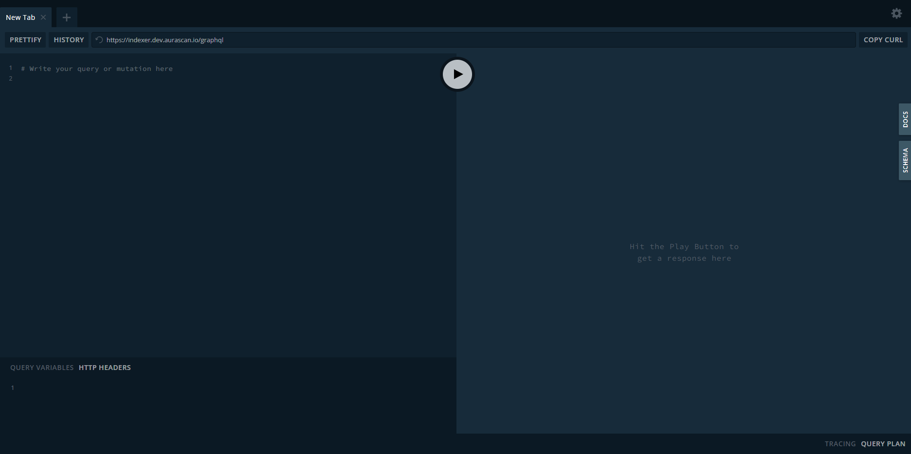
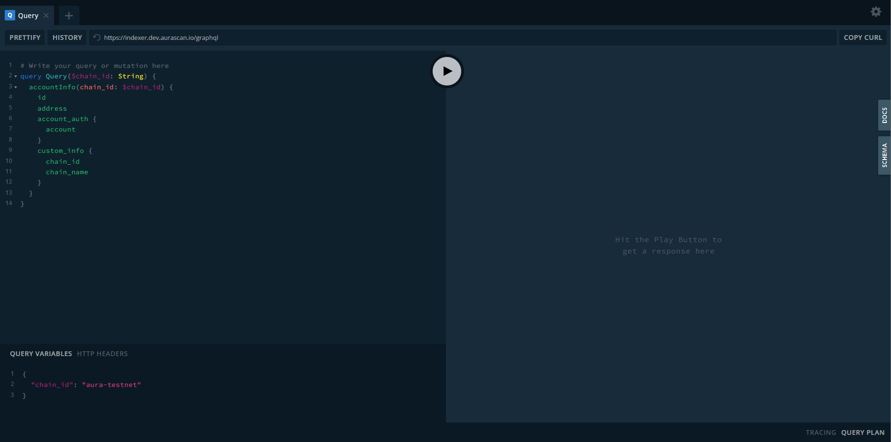

# GraphQL

Horoscope provides a GraphQL service for client to query all data inside it.

## Endpoints

- Dev Environment: https://indexer.dev.aurascan.io/graphql
- Staging Environment: https://indexer.staging.aurascan.io/graphql
- Prod Environment: https://horoscope.aura.network/graphql

## Use Case

GraphQL provides a complete and understandable description of the data in your API, gives clients the power to ask for exactly what they need and nothing more, makes it easier to evolve APIs over time, and enables powerful developer tools.

For more information, please visit [GraphQL homepage](https://graphql.org/).

## How to use

- To use the GraphQL service, first visit one of our endpoints.

- The query format is as below.

- You can check for the query document and the schema here.

